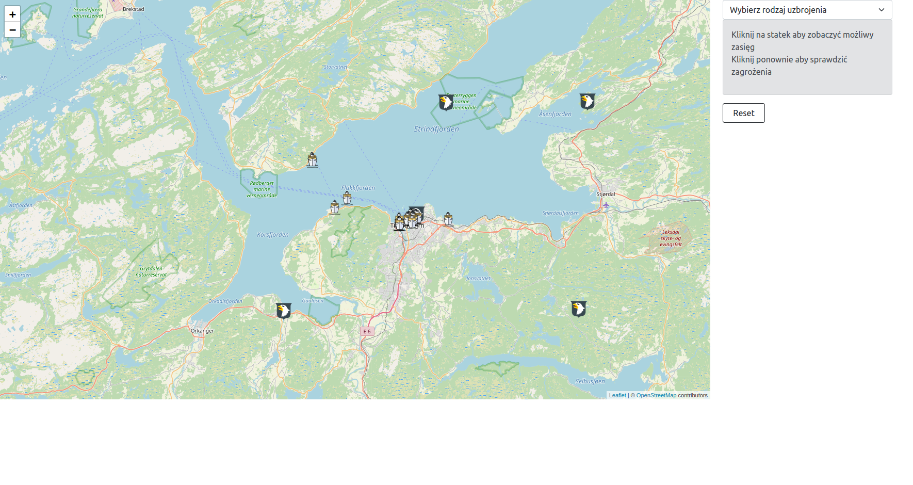
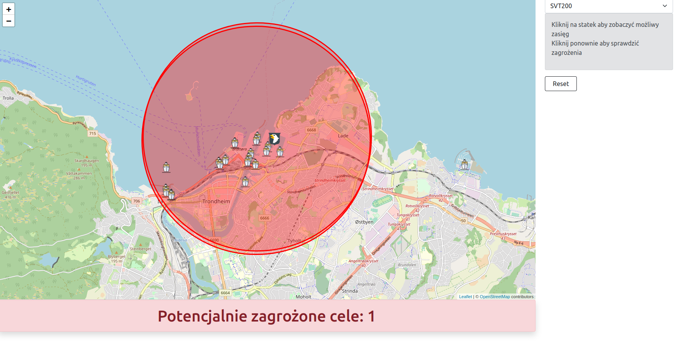
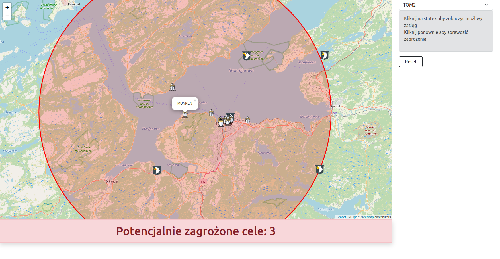

Vessel tracking application
# aisTracking
## Table of contents
* [General info](#general-info)
* [Backend](#backend)
* [Frontend](#frontend)
* [Screenshots](#screenshots)

## The application downloads ship position data from the api https://www.barentswatch.no/. Each ship is treated as hostile. From the menu you can select the type of weapon the ship could potentially have and check how many targets it can reach. The eagle icon marks strategic points / friendly ships.

## Backend
* Java
* Spring boot
* Hibernate
* PostgreSQL
* Docker

## Frontend
* React
* Bootstrap
* Leaflet
* Icons website https://icons8.com/

## Screenshots
Start page

View after click on the ship

Another view

